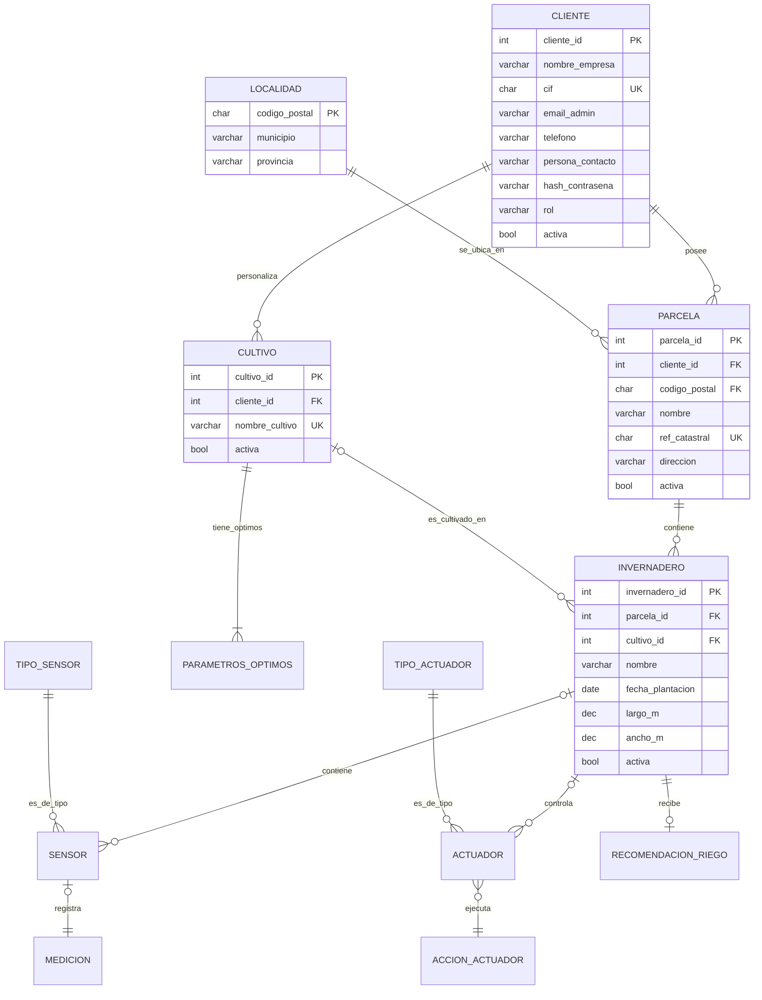

# SIRA Project 🌱💧

> **Sistema Integral de Riego Automático (SIRA)**  
> Proyecto Fin de Grado — ASIR  
> Plataforma completa para la gestión inteligente de sensores, zonas y actuadores en invernaderos.  
> **Frontend:** Interfaz web moderna (PHP/CSS) 100% libre de Javascript.  
> **Backend:** API REST en Python (FastAPI) con base de datos PostgreSQL.  
> **Infraestructura:** Desplegado con Docker Compose y servido mediante Nginx.

[](#)
[](#)
[](#)

---

## 🧑‍💻 Stack Tecnológico

| PHP 8.2         | Interfaz de usuario y lógica de presentación (SSR)         |
| CSS 3 (Vanilla) | Diseño moderno, responsivo y modo oscuro                   |
| Python FastAPI  | API REST backend de alto rendimiento                       |
| PostgreSQL      | Base de datos relacional                                   |
| Nginx           | Proxy inverso y servidor web unificado                     |
| Docker / Compose| Orquestación de servicios y contenedores                   |

---

## 📦 Estructura del Proyecto

```
SIRA_Project/
├── backend/            # Backend API (Python/FastAPI)
│   ├── app/            # Lógica de la API, modelos y rutas
│   ├── database/       # Scripts SQL y configuración de BBDD
│   ├── Dockerfile
│   └── requirements.txt
├── frontend/           # Interfaz Web (PHP 8.2)
│   ├── css/            # Estilos CSS modernos (0% JS)
│   ├── dashboard/      # Vistas del panel de control
│   ├── management/     # Gestión de usuarios e infraestructura
│   ├── includes/       # Componentes PHP reutilizables
│   └── index.php       # Punto de entrada (Login)
├── nginx/              # Configuración del servidor y proxy
├── docker-compose.yml  # Orquestación de toda la plataforma
├── .env.example        # Plantilla de variables de entorno
├── docs/               # Documentación y diagramas Mermaid
└── data/               # [VOLUMEN] Búnker de seguridad Iron Fortress
```

---

---

## 🛡️ Seguridad: "Iron Fortress"

SIRA implementa un protocolo de seguridad avanzado para proteger los activos e identidad de los agricultores. Los pilares de nuestra seguridad son:

- **Búnker de Persistencia**: Historial de seguridad (hashes y rotación) aislado en volúmenes Docker.
- **Acceso JWT**: Autenticación Stateless con roles jerárquicos.
- **IoT-Token**: Seguridad perimetral para la inyección de telemetría.
- **Blindaje UI**: Protección anti-autocompletado a nivel de diseño.

Para más detalles sobre la arquitectura de defensa, consulta el [Manifiesto de Seguridad SIRA](docs/SIRA_SECURITY_MANIFIESTO.md).

---

## 🏛️ Arquitectura y Comunicación

La plataforma SIRA utiliza una arquitectura de **Separación de Responsabilidades** mediada por un Proxy Inverso (Nginx):

1.  **Capa de Presentación (Frontend):** Servidor PHP 8.2 que genera HTML dinámico mediante Renderizado en el Servidor (SSR). Es completamente **libre de Javascript**, utilizando exclusivamente CSS moderno para la interactividad visual (hover, transiciones, grid).
2.  **Capa de Lógica (Backend):** API REST construida con FastAPI (Python) que gestiona la base de datos, la lógica de negocio y la seguridad (JWT).
3.  **Comunicación:** El Frontend se comunica con el Backend mediante peticiones `cURL` (PHP-to-API). El token JWT se almacena de forma segura en la sesión de PHP tras el login.

---

## 🎨 Frontend (Interfaz de Usuario)

El diseño del frontend se ha centrado en la **estética premium** y la **eficiencia**:

-   **0% Javascript:** Toda la lógica de navegación y estado se gestiona en el servidor, eliminando latencias de carga de scripts y problemas de compatibilidad.
-   **CSS Moderno:** Uso intensivo de Flexbox, CSS Grid y variables para un diseño responsivo y elegante (Glassmorphism).
-   **Dashboard Jerárquico:** Visualización organizada de Parcelas e Invernaderos.
-   **Monitoreo en Tiempo Real:** Seguimiento de sensores IoT (Temperatura, Humedad, Luz) mediante actualizaciones rápidas de página.

---

## 🚀 Puesta en marcha

### Requisitos

- Git
- Docker y Docker Compose (`docker compose` >= v2.x)
- Python 3.10+ (solo para ejecución local sin Docker)

### Instalación rápida (recomendada: Docker Compose)

1. **Clonar el repositorio**

```bash
git clone https://github.com/JuanRisueno/SIRA_Project.git
cd SIRA_Project
```

2. **Configurar variables de entorno**

```bash
cp .env.example .env
# Edita .env con tus credenciales y ajustes básicos
```

3. **Desplegar servicios Docker**

```bash
docker compose up --build -d
```

4. **Verificar servicios**

```bash
docker compose ps
docker compose logs -f
```

5. **Acceder al Sistema**

-   **Interfaz Web:** [http://localhost:8085](http://localhost:8085) (Login y Dashboard)
-   **Documentación API:** [http://localhost:8085/api/docs](http://localhost:8085/api/docs) (Swagger)
-   **ReDoc:** [http://localhost:8085/api/redoc](http://localhost:8085/api/redoc)

> [!TIP]
> Si estás en un entorno de desarrollo local y no usas Docker, la API corre por defecto en el puerto `8000`.

6. **Parar todo**

```bash
docker compose down
```

---

## 🧪 Desarrollo local (sin Docker)

```bash
cd backend
python3 -m venv .venv
source .venv/bin/activate
pip install -r requirements.txt
uvicorn app.main:app --reload --host 0.0.0.0 --port 8000
```

- Docs locales: [http://localhost:8000/docs](http://localhost:8000/docs) (Swagger)
- [http://localhost:8000/redoc](http://localhost:8000/redoc) (ReDoc)

---

## 🔑 Variables de entorno importantes

```env
DB_USER=usuario
DB_PASSWORD=contraseña
DB_NAME=sira_db
DATABASE_URL=postgresql://${DB_USER}:${DB_PASSWORD}@db:5432/${DB_NAME}
```
- El servicio de base de datos en `docker-compose.yml` se llama `db`.
- Estas variables deben configurarse en `.env`, usando como base `.env.example`.

---

## 🛠️ Comandos útiles

- Levantar servicios en primer plano:  `docker compose up`
- Levantar en modo detached:           `docker compose up -d`
- Ver estado:                          `docker compose ps`
- Logs del API:                        `docker compose logs -f api`
- Acceso a PostgreSQL:                 `docker compose exec db psql -U ${DB_USER} -d ${DB_NAME}`

---

## 🩺 Pruebas rápidas

- **Endpoint health** (Verificación):
  ```bash
  curl -sS http://localhost:8085/api/ || echo "API no responde"
  ```
- **Probar documentación (Swagger):**
  ```bash
  curl -s http://localhost:8085/docs | head -n 20
  ```

---

- **Diagrama Entidad-Relación:**



- **Documentación Completa:** 
  - [🛡️ Manifiesto de Seguridad Iron Fortress](docs/SIRA_SECURITY_MANIFIESTO.md)
  - [📜 Manifiesto del Proyecto (Estándares)](docs/SIRA_MANIFESTO.md)
  - [🏗️ Infraestructura y Variables](docs/infraestructura/variables_entorno.md)
  - [🧪 Lógica IoT y Simulación](docs/planificacion/simulacion_iot.md)

---

## 🤝 Contribuir

1. Haz fork del proyecto
2. Crea una rama feature (`git checkout -b feature/nueva-funcionalidad`)
3. Haz commits pequeños y descriptivos
4. Realiza Push y abre un Pull Request
5. Añade tests para cambios importantes

---

## 📄 Licencia

Proyecto desarrollado como Proyecto Fin de Grado para ASIR.  
Licencia MIT — ajusta si procede.

Copyright (c) 2025 Juan Risueno

---

## 📬 Autor/es y colaboradores

- Juan Risueno (Arquitectura y Backend)
- Jorge Pedro López (Bases de Datos y Frontend)
- Alfonso Navarro (Documentación y CSS)
- Email de contacto: risu.profesional@gmail.com

---

## 🔜 Próximos pasos sugeridos

- Añadir badges de CI / coverage
- Crear plantillas de Issue y PR en `.github/`
- Añadir workflows (GitHub Actions: lint + tests)
- Incluir ejemplos de peticiones a la API en `examples/`
- Mejorar seguridad con validaciones adicionales en FastAPI
