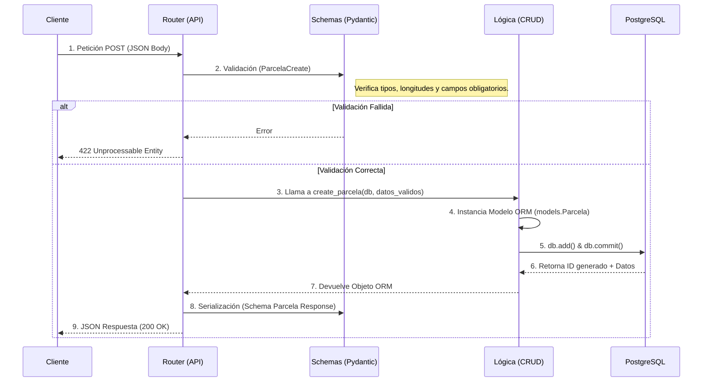
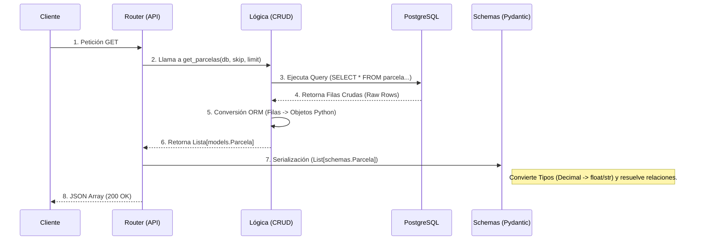

# Flujo de Datos en SIRA (Arquitectura API REST)

Este documento detalla el ciclo de vida de los datos dentro del Backend de SIRA. Describe cómo la información viaja desde el Cliente (Frontend/IoT) hasta la Base de Datos y viceversa, explicando la responsabilidad técnica de cada capa de la aplicación.

---

## 1. Actores y Componentes

* **Cliente:** El iniciador de la petición (Navegador Web, Script Python, Raspberry Pi, Postman).
* **Router (`main.py` / `routers/`):** Punto de entrada HTTP. Gestiona las rutas (`endpoints`), códigos de estado y seguridad.
* **Schemas (`schemas.py`):** Capa de validación y serialización (Pydantic). Convierte JSON <-> Objetos Python.
* **CRUD (`crud.py`):** Capa de lógica de negocio y acceso a datos. Contiene las funciones puras.
* **Modelos (`models.py`):** Capa ORM (SQLAlchemy). Mapea clases de Python a tablas SQL.
* **Base de Datos (PostgreSQL):** Almacenamiento físico y persistente de la información.

---

## 2. Flujo de Escritura (CREATE / UPDATE)

**Ejemplo:** Crear una nueva Parcela (`POST /parcelas/`).

El objetivo es recibir datos externos inseguros (JSON), validarlos, transformarlos y persistirlos de forma segura.

### Diagrama de Secuencia

### Detalle Técnico de los Pasos

1. **Recepción:** `main.py` recibe el JSON crudo.

2. **Validación (Input):** FastAPI utiliza el esquema `ParcelaCreate` (definido en `schemas.py`) para verificar los datos. Si el `ref_catastral` no tiene 14 caracteres, el proceso se detiene aquí.

3. **Delegación:** Si los datos son válidos, el Router pasa los datos limpios a la función `create_parcela` en `crud.py`.

4. **Transformación (Mapping):** `crud.py` toma los datos del schema y crea una instancia de la clase `Parcela` definida en `models.py`.

5. **Transacción:** Se abre una sesión con la BBDD. Se añade el objeto y se ejecuta `COMMIT` para hacer los cambios permanentes.

6. **Persistencia:** PostgreSQL guarda la fila y genera el `parcela_id` (Serial).

7. **Retorno Interno:** La BBDD actualiza el objeto en memoria de Python con el nuevo ID.

8. **Serialización (Output):** El Router toma el objeto ORM y lo pasa por el schema de respuesta `Parcela`. Aquí se filtran datos sensibles si los hubiera.

9. **Respuesta:** El cliente recibe un JSON con el ID confirmado.

---

## 3. Flujo de Lectura (READ)

**Ejemplo:** Consultar todas las parcelas (`GET /parcelas/`).

El objetivo es extraer datos de la BBDD, convertirlos en objetos manipulables y enviarlos al cliente en formato estándar (JSON).

### Diagrama de Secuencia

### Detalle Técnico de los Pasos

1. **Petición:** El cliente solicita datos (puede incluir parámetros de paginación en la URL).

2. **Consulta:** El Router solicita los datos a `crud.py`.

3. **Query SQL:** SQLAlchemy traduce la petición Python (`db.query(models.Parcela)`) a una sentencia SQL optimizada (`SELECT`).

4. **Extracción:** PostgreSQL devuelve los datos binarios/texto.

5. **Hidratación de Objetos:** SQLAlchemy convierte esas filas en una lista de instancias de la clase `Parcela`.

6. **Retorno Interno:** `crud.py` devuelve la lista de objetos a `main.py`.

7. **Validación de Salida y Serialización:**
   - FastAPI usa `response_model=list[schemas.Parcela]`.
   - Pydantic recorre la lista de objetos.
   - Si el schema incluye relaciones (ej: `cliente: Cliente`), Pydantic busca esos datos anidados automáticamente.
   - Los tipos complejos como `Decimal` o `datetime` se convierten a formatos compatibles con JSON (`float` o string ISO).

8. **Respuesta:** El cliente recibe la lista limpia en formato JSON.

---

## 4. Resumen de Responsabilidades por Archivo

| Archivo | Rol Técnico | ¿Qué manipula? |
|---------|-------------|----------------|
| `models.py` | Estructura Física | Define las tablas SQL, columnas, tipos de datos y Foreign Keys. Es el espejo de la BBDD. |
| `schemas.py` | Contrato de Interfaz | Define qué JSON entra y qué JSON sale. Valida datos y filtra información. |
| `crud.py` | Operador (DAL) | Realiza las operaciones efectivas sobre la BBDD. No sabe de HTTP, solo de datos. |
| `main.py` | Controlador | Recibe HTTP, orquesta la llamada al CRUD y selecciona el Schema de respuesta. |