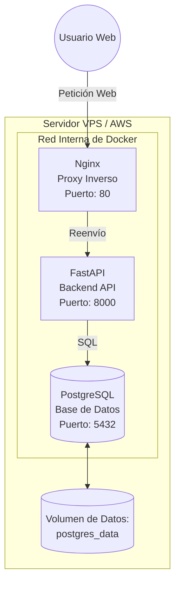

# Arquitectura del Sistema y Contenedores - Proyecto SIRA

En este documento describo cómo está montado el sistema SIRA a nivel de servidores y contenedores. Para facilitar el despliegue y asegurar que el entorno sea siempre el mismo, he utilizado **Docker** y **Docker Compose**.

## Diagrama de la Infraestructura

El sistema se divide en tres partes principales que se comunican entre sí a través de una red interna privada de Docker.

## Componentes del Sistema

1. **Nginx**: Es la "puerta de entrada" al sistema. Recibe todas las peticiones desde el exterior y las pasa al backend de forma segura. Al usar Nginx, puedo ocultar los demás servicios de Internet, mejorando la seguridad.
2. **FastAPI (Backend)**: Es el corazón de la aplicación. Aquí está escrito todo el código Python que gestiona la lógica del riego, los usuarios y los sensores.
3. **PostgreSQL (Base de Datos)**: Es donde se guarda toda la información de los clientes, las parcelas y las lecturas de los sensores. He configurado un "volumen de datos" para que, aunque se apague el servidor, la información no se pierda.

---
**Arquitectura del Sistema - SIRA**  
*Versión 1.0 Final - Abril 2026*
