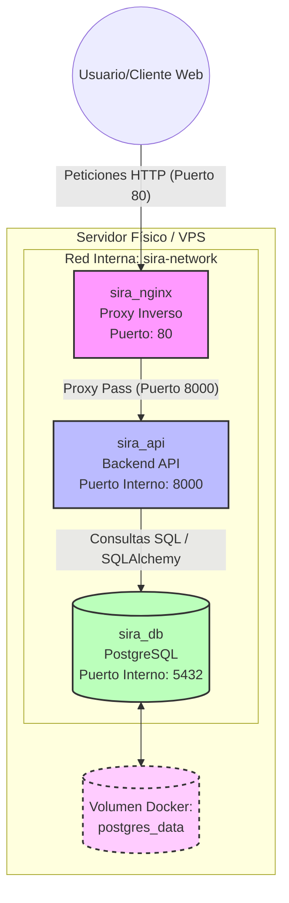

# Arquitectura de infraestructura de SIRA

Este documento describe la arquitectura a nivel de red y contenedores (Docker) del **Sistema Integral de Riego Automático (SIRA)**.

## Diagrama de Contenedores y Red
El sistema está compuesto por tres servicios principales orquestados mediante Docker Compose. Todos los contenedores se comunican internamente a través de una red aislada (`sira-network`), sin exponer puertos innecesarios al exterior.

## Descripción de los Componentes

1. **`sira_nginx`**: Único punto de entrada expuesto públicamente (Puerto 80 abierto en el host). Recibe las peticiones HTTP y las encamina de forma segura al backend. Aisla a la aplicación de conexiones lentas y ataques básicos.
2. **`sira_api`**: Contenedor principal construido a partir del código Python. Ejecuta FastAPI utilizando Uvicorn. No está expuesto a Internet directamente; solo responde a lo que Nginx le envíe.
3. **`sira_db`**: Base de datos relacional PostgreSQL. Está completamente aislada. La API accede a ella resolviendo el nombre DNS interno `db`. Sus datos son persistentes gracias al volumen `postgres_data`, el cual evita la pérdida de información si el contenedor se destruye o reinicia.
